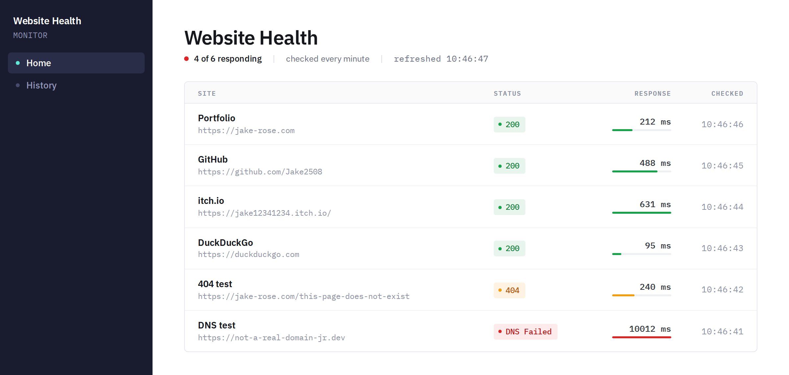

# Website Health Monitor

A self-hosted dashboard that checks a list of websites every minute and shows whether each one is up, how fast it answered, and when it was last checked.



## Features

- **Checks every minute.** A background worker sends a request to every enabled site and records the status code and response time.
- **Clear status colours.** Green for 2xx, amber for other HTTP statuses (e.g. `404`), red when there's no response at all (`DNS Failed`, `Timed Out`).
- **Latency bars.** Each row's bar is scaled against the slowest site that responded, so you can compare response times at a glance.
- **Live dashboard.** The page refreshes itself every 10 seconds, so you never need to reload.
- **7-day history.** Results are stored in SQLite, and anything older than 7 days is pruned automatically.
- **Zero setup database.** The database file is created and migrated on startup, and sites are seeded from `appsettings.json`.

## Tech stack

| Layer      | Choice                                             |
|------------|----------------------------------------------------|
| Framework  | .NET 10, Blazor Web App (Interactive Server)       |
| Data       | Entity Framework Core 10 + SQLite                  |
| Checks     | `BackgroundService` + `IHttpClientFactory`         |
| UI         | Plain CSS (no Bootstrap), IBM Plex Sans / Mono     |

## Getting started

**Prerequisites:** [.NET 10 SDK](https://dotnet.microsoft.com/download)

```bash
git clone https://github.com/Jake2508/Web-Health-Monitor.git
cd Web-Health-Monitor
dotnet run
```

Open http://localhost:5266. For HTTPS, run `dotnet run --launch-profile https` and open https://localhost:7290.

The first check runs as soon as the app starts, so the dashboard fills in within a few seconds.

## Configuration

Sites are defined in `appsettings.json`:

```json
"Monitoring": {
  "Sites": [
    { "Name": "Portfolio", "Url": "https://jake-rose.com" },
    { "Name": "DNS test",  "Url": "https://not-a-real-domain-jr.dev" }
  ]
}
```

> **Note:** this list is only used to seed an **empty** database. After the first run, editing `appsettings.json` has no effect. To re-seed, stop the app and delete `monitor.db` (it's git-ignored).

Other settings are constants in code:

| Setting                  | Value      | Where                                    |
|--------------------------|------------|------------------------------------------|
| Check interval           | 1 minute   | `Services/HealthCheckWorker.cs`          |
| Result retention         | 7 days     | `Services/HealthCheckWorker.cs`          |
| Request timeout          | 10 seconds | `Program.cs` (`"health"` HttpClient)     |
| Dashboard refresh        | 10 seconds | `Components/Pages/Home.razor`            |
| Database connection      | `Data Source=monitor.db` | `appsettings.json`         |

## How it works

1. On startup, `Program.cs` applies EF Core migrations and seeds sites if the table is empty.
2. `HealthCheckWorker` runs one cycle immediately, then once a minute:
   - sends a `GET` to each enabled site, reading headers only (the body isn't downloaded)
   - saves a `CheckResult` with the status code, response time, and an error label if the request failed
   - deletes results older than the retention window
3. `Home.razor` loads the latest result for each site and re-queries every 10 seconds.

A site counts as **responding** when it returns a 2xx status.

## Project structure

```
Components/
  Layout/        MainLayout, NavMenu (sidebar)
  Pages/         Home (dashboard), History (placeholder)
Data/            AppDbContext, MonitoredSite, CheckResult
Migrations/      EF Core migrations
Services/        HealthCheckWorker (background checks)
wwwroot/app.css  Design tokens and shared styles
```