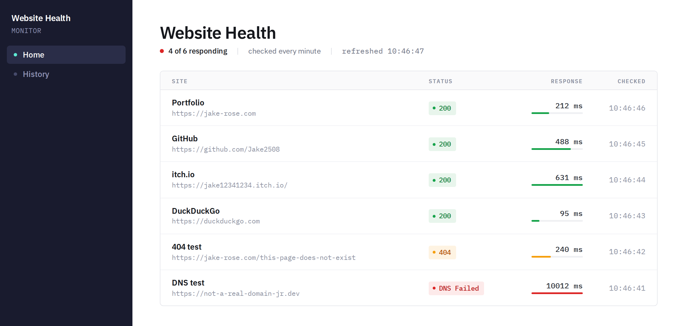

# Website Health Monitor

**Repository for my self-hosted website uptime monitor**

---

## Overview

A dashboard that checks a list of websites every minute and shows whether each one is up, how fast it responded, and when it was last checked. A background worker runs the checks and stores every result in **SQLite**, and the **Blazor** dashboard updates itself live. Built with **C#** and **.NET 10**.

---



---

## Features

- **Background Checks**: A worker sends a request to every enabled site once a minute and records the status code and response time.
- **Clear Status Colours**: Green for 2xx, amber for other HTTP statuses (e.g. `404`), red when there's no response at all (`DNS Failed`, `Timed Out`).
- **Latency Bars**: Each bar is scaled against the slowest site, so response times can be compared at a glance.
- **Live Dashboard**: The page refreshes every 10 seconds, so there's no need to reload.
- **7-Day History**: Results older than 7 days are pruned automatically.
- **Zero-Setup Database**: The database is created and migrated on startup, and sites are seeded from `appsettings.json`.

---

## Getting Started

To get the project up and running on your local machine, follow these steps:

1. **Install the [.NET 10 SDK](https://dotnet.microsoft.com/download)**

2. **Clone the repository**:
   ```bash
   git clone https://github.com/Jake2508/Web-Health-Monitor.git
   cd Web-Health-Monitor
   ```

3. **Run the app**:
   ```bash
   dotnet run
   ```

4. **Open** [http://localhost:5266](http://localhost:5266). The first check runs on startup, so the dashboard fills in within a few seconds.

Note: the sites to monitor are set in `appsettings.json`, but they only seed an empty database. To change them after the first run, stop the app and delete `monitor.db`.

---

## Built With

.NET 10 / Blazor - Web app and live dashboard UI.

C# - Background health check worker and app logic.

Entity Framework Core + SQLite - Stores sites and check results.

CSS - Custom styling, no UI framework.

## Author
***Jake Rose***

Website: [https://jake-rose.com/](https://jake-rose.com/)
